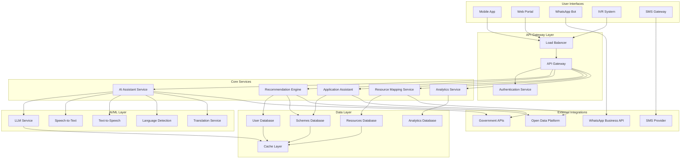

# Design Document: LokSaarthi AI

## Overview

LokSaarthi AI is a comprehensive AI-powered community assistance platform designed to bridge the digital divide between citizens and public services in India. The system provides multi-modal, multi-language access to government schemes, welfare programs, healthcare services, and employment opportunities through a unified interface.

The platform leverages modern AI technologies including Large Language Models (LLMs), Indic Natural Language Processing, and speech recognition to create an accessible, inclusive digital public service platform that works across various devices and connectivity conditions.

## Architecture

### High-Level Architecture



### Technology Stack

**Backend Services:**
- **Runtime:** Node.js with TypeScript for API services
- **AI/ML:** Python with FastAPI for AI services
- **Database:** PostgreSQL for structured data, Redis for caching
- **Message Queue:** Apache Kafka for async processing
- **Search:** Elasticsearch for content and resource search

**AI/ML Technologies:**
- **LLM:** OpenAI GPT-4 or Anthropic Claude for conversational AI
- **Indic NLP:** AI4Bharat's IndicNLP library and IndicTTS for regional language support
- **Speech Processing:** Google Cloud Speech-to-Text/Text-to-Speech with Indic language models
- **Translation:** Google Translate API with custom Indic language models

**Frontend Technologies:**
- **Mobile:** React Native for cross-platform mobile app
- **Web:** React.js with responsive design
- **WhatsApp:** WhatsApp Business API integration
- **IVR:** Twilio Voice API with custom speech processing

**Infrastructure:**
- **Cloud:** AWS/Google Cloud Platform
- **Containers:** Docker with Kubernetes orchestration
- **CDN:** CloudFront for static content delivery
- **Monitoring:** Prometheus, Grafana, and ELK stack

## Components and Interfaces

### 1. AI Assistant Service

**Purpose:** Core conversational AI that handles user interactions across all channels.

**Key Components:**
- **Conversation Manager:** Maintains context across multi-turn conversations
- **Intent Recognition:** Identifies user intents from natural language input
- **Response Generation:** Creates contextually appropriate responses
- **Language Router:** Directs requests to appropriate language models

**Interfaces:**
```typescript
interface AIAssistantService {
  processMessage(request: ConversationRequest): Promise<ConversationResponse>
  detectLanguage(text: string): Promise<LanguageCode>
  translateMessage(text: string, targetLanguage: LanguageCode): Promise<string>
  generateSpeech(text: string, language: LanguageCode): Promise<AudioBuffer>
  processSpeech(audio: AudioBuffer): Promise<string>
}

interface ConversationRequest {
  userId: string
  message: string
  channel: 'mobile' | 'web' | 'whatsapp' | 'ivr' | 'sms'
  language?: LanguageCode
  context?: ConversationContext
}

interface ConversationResponse {
  message: string
  audioResponse?: AudioBuffer
  suggestedActions?: Action[]
  requiresFollowUp: boolean
  context: ConversationContext
}
```

### 2. Recommendation Engine

**Purpose:** Analyzes user profiles to provide personalized scheme and opportunity recommendations.

**Key Components:**
- **Profile Analyzer:** Processes user demographic and preference data
- **Eligibility Matcher:** Matches users to eligible schemes based on criteria
- **Ranking Algorithm:** Prioritizes recommendations by relevance and urgency
- **Opportunity Tracker:** Monitors new schemes and opportunities

**Interfaces:**
```typescript
interface RecommendationEngine {
  generateRecommendations(userId: string): Promise<Recommendation[]>
  updateUserProfile(userId: string, profile: UserProfile): Promise<void>
  checkEligibility(userId: string, schemeId: string): Promise<EligibilityResult>
  trackOpportunity(userId: string, opportunityId: string): Promise<void>
}

interface UserProfile {
  age: number
  gender: 'male' | 'female' | 'other'
  location: Location
  occupation: string
  income: number
  education: EducationLevel
  familySize: number
  disabilities?: string[]
}

interface Recommendation {
  id: string
  type: 'scheme' | 'job' | 'scholarship' | 'healthcare'
  title: string
  description: string
  eligibilityMatch: number
  deadline?: Date
  applicationUrl?: string
  requiredDocuments: string[]
}
```

### 3. Application Assistant Service

**Purpose:** Provides step-by-step guidance for government scheme applications.

**Key Components:**
- **Form Parser:** Analyzes government forms and creates guided workflows
- **Document Manager:** Handles document upload and validation
- **Status Tracker:** Monitors application progress across government systems
- **Notification Service:** Sends updates via SMS and app notifications

**Interfaces:**
```typescript
interface ApplicationAssistant {
  startApplication(userId: string, schemeId: string): Promise<ApplicationSession>
  getNextStep(sessionId: string): Promise<ApplicationStep>
  submitStep(sessionId: string, stepData: StepData): Promise<StepResult>
  uploadDocument(sessionId: string, document: DocumentUpload): Promise<DocumentResult>
  trackStatus(applicationId: string): Promise<ApplicationStatus>
}

interface ApplicationStep {
  stepNumber: number
  title: string
  description: string
  fields: FormField[]
  requiredDocuments: DocumentRequirement[]
  validationRules: ValidationRule[]
}

interface ApplicationStatus {
  applicationId: string
  currentStage: string
  status: 'pending' | 'approved' | 'rejected' | 'requires_action'
  lastUpdated: Date
  nextAction?: string
}
```

### 4. Resource Mapping Service

**Purpose:** Maintains and provides location-based information about public resources and services.

**Key Components:**
- **Location Service:** Handles geolocation and proximity calculations
- **Resource Database:** Maintains current information about public facilities
- **Data Sync Manager:** Updates resource information from government databases
- **Search Engine:** Provides fast, location-aware resource search

**Interfaces:**
```typescript
interface ResourceMappingService {
  findNearbyResources(location: Location, type: ResourceType, radius: number): Promise<Resource[]>
  getResourceDetails(resourceId: string): Promise<ResourceDetails>
  reportResourceIssue(resourceId: string, issue: ResourceIssue): Promise<void>
  updateResourceInfo(resourceId: string, updates: ResourceUpdate): Promise<void>
}

interface Resource {
  id: string
  name: string
  type: ResourceType
  location: Location
  distance: number
  contactInfo: ContactInfo
  operatingHours: OperatingHours
  services: string[]
  accessibility: AccessibilityInfo
}

type ResourceType = 'hospital' | 'government_office' | 'skill_center' | 'ngo' | 'legal_aid' | 'bank' | 'post_office'
```

### 5. Analytics Service

**Purpose:** Provides insights and analytics for government officials and platform administrators.

**Key Components:**
- **Data Aggregator:** Collects and processes usage analytics
- **Report Generator:** Creates customizable reports and dashboards
- **Trend Analyzer:** Identifies patterns in service usage and user needs
- **Privacy Manager:** Ensures all analytics comply with privacy regulations

**Interfaces:**
```typescript
interface AnalyticsService {
  generateUsageReport(timeRange: TimeRange, filters: AnalyticsFilters): Promise<UsageReport>
  getSchemeAdoptionMetrics(schemeId: string): Promise<AdoptionMetrics>
  getTrendingQueries(region?: string, timeRange?: TimeRange): Promise<QueryTrend[]>
  exportData(reportType: ReportType, format: 'csv' | 'pdf'): Promise<ExportResult>
}

interface UsageReport {
  totalUsers: number
  activeUsers: number
  queriesProcessed: number
  applicationsSubmitted: number
  geographicDistribution: RegionMetrics[]
  languageDistribution: LanguageMetrics[]
  channelUsage: ChannelMetrics[]
}
```

## Data Models

### User Data Model

```typescript
interface User {
  id: string
  phoneNumber: string
  email?: string
  profile: UserProfile
  preferences: UserPreferences
  createdAt: Date
  lastActive: Date
  verificationStatus: 'pending' | 'verified'
}

interface UserPreferences {
  preferredLanguage: LanguageCode
  preferredChannel: 'mobile' | 'web' | 'whatsapp' | 'sms'
  notificationSettings: NotificationSettings
  privacySettings: PrivacySettings
}
```

### Scheme Data Model

```typescript
interface Scheme {
  id: string
  name: string
  description: string
  category: SchemeCategory
  eligibilityCriteria: EligibilityCriteria
  benefits: string[]
  applicationProcess: ApplicationProcess
  requiredDocuments: string[]
  deadline?: Date
  governmentDepartment: string
  officialUrl: string
  isActive: boolean
  lastUpdated: Date
}

interface EligibilityCriteria {
  ageRange?: { min: number; max: number }
  genderRequirement?: 'male' | 'female' | 'any'
  incomeRange?: { min: number; max: number }
  locationRequirements?: string[]
  educationRequirement?: EducationLevel
  occupationRequirements?: string[]
  specialConditions?: string[]
}

type SchemeCategory = 'welfare' | 'education' | 'healthcare' | 'employment' | 'housing' | 'agriculture' | 'business'
```

### Resource Data Model

```typescript
interface ResourceDetails {
  id: string
  name: string
  type: ResourceType
  location: Location
  contactInfo: ContactInfo
  operatingHours: OperatingHours
  services: Service[]
  accessibility: AccessibilityInfo
  ratings: ResourceRating[]
  lastVerified: Date
  governmentId?: string
}

interface Location {
  latitude: number
  longitude: number
  address: string
  city: string
  state: string
  pincode: string
}

interface Service {
  name: string
  description: string
  requirements?: string[]
  processingTime?: string
  fees?: number
}
```

### Conversation Data Model

```typescript
interface ConversationContext {
  userId: string
  sessionId: string
  currentIntent?: string
  entities: Record<string, any>
  conversationHistory: Message[]
  language: LanguageCode
  channel: Channel
  lastInteraction: Date
}

interface Message {
  id: string
  sender: 'user' | 'assistant'
  content: string
  timestamp: Date
  metadata?: Record<string, any>
}
```

## Correctness Properties

*A property is a characteristic or behavior that should hold true across all valid executions of a system—essentially, a formal statement about what the system should do. Properties serve as the bridge between human-readable specifications and machine-verifiable correctness guarantees.*

Based on the prework analysis, the following properties have been identified to validate the system's correctness:

### Property 1: Multi-language Response Consistency
*For any* user with a specified language preference, when they initiate a conversation, the AI Assistant should respond in their selected regional language and maintain that language throughout the conversation.
**Validates: Requirements 1.1**

### Property 2: Speech Processing Round-trip
*For any* supported regional language, when a user provides speech input, the system should convert it to text, process the request, and provide both text and audio responses in the same language.
**Validates: Requirements 1.2, 1.3**

### Property 3: Cross-channel Feature Parity
*For any* core functionality available on one platform, the same functionality should be available and work consistently across all supported channels (mobile, web, WhatsApp, IVR).
**Validates: Requirements 1.4, 1.5, 6.5, 6.6**

### Property 4: Comprehensive Eligibility Analysis
*For any* completed user profile, the recommendation engine should identify all schemes for which the user is eligible and include all opportunity categories (scholarships, jobs, healthcare, welfare).
**Validates: Requirements 2.1, 2.4**

### Property 5: Recommendation Ranking and Explanation
*For any* set of recommendations generated for a user, they should be ranked by relevance to the user's profile, include explanations for the match, and display all required information (deadlines, eligibility).
**Validates: Requirements 2.2, 2.5, 2.6**

### Property 6: Application Workflow Completeness
*For any* scheme application, the system should provide complete step-by-step guidance, auto-populate available profile data, generate unique tracking references, and validate all data before submission.
**Validates: Requirements 3.1, 3.2, 3.3, 3.6**

### Property 7: Notification and Document Management
*For any* application requiring documents or status updates, the system should provide clear document checklists with upload interfaces and send SMS notifications when status changes occur.
**Validates: Requirements 3.4, 3.5**

### Property 8: Location-based Resource Discovery
*For any* user location and resource search, results should be sorted by proximity and include all required information (contact details, hours, services, navigation options).
**Validates: Requirements 4.1, 4.2, 4.3**

### Property 9: Resource Issue Reporting
*For any* user report of incorrect resource information, the system should flag the resource for verification and maintain data quality.
**Validates: Requirements 4.6**

### Property 10: Adaptive Connectivity Management
*For any* connectivity condition (poor, offline, restored), the system should automatically adapt its behavior (switch to low-bandwidth mode, use cached data, sync when restored) while maintaining core functionality.
**Validates: Requirements 5.1, 5.2, 5.3, 5.6**

### Property 11: Alternative Access Methods
*For any* basic query or status update, the system should provide equivalent functionality through SMS and IVR channels without requiring internet connectivity.
**Validates: Requirements 5.4, 5.5**

### Property 12: Comprehensive Analytics Generation
*For any* analytics request, the system should generate reports containing all required metrics (usage statistics, adoption rates, geographic distribution, trending queries) in requested formats while ensuring data anonymization.
**Validates: Requirements 7.1, 7.2, 7.3, 7.4, 7.5, 7.6**

### Property 13: Data Security and Privacy Protection
*For any* user data operation (storage, access, sharing, deletion), the system should apply appropriate security measures (encryption, consent verification, audit logging, MFA for admin access) and complete deletion requests.
**Validates: Requirements 8.1, 8.3, 8.4, 8.5, 8.6**

### Property 14: Government System Integration Reliability
*For any* interaction with government APIs, the system should use official data sources, provide real-time status checking, handle failures gracefully with cached fallbacks, and validate data integrity.
**Validates: Requirements 9.1, 9.2, 9.4, 9.6**

### Property 15: System Resilience and Auto-scaling
*For any* system component failure or demand change, the system should automatically failover to backup systems and adjust capacity to maintain service availability.
**Validates: Requirements 10.4, 10.6**

## Error Handling

### Error Categories and Strategies

**1. User Input Errors**
- **Invalid Language Detection:** Fallback to English with language selection prompt
- **Malformed Speech Input:** Request user to repeat with clearer pronunciation
- **Incomplete Profile Data:** Guide user through missing information collection
- **Invalid Form Data:** Provide specific validation messages and correction guidance

**2. External System Failures**
- **Government API Unavailability:** Serve cached data with staleness indicators
- **WhatsApp API Failures:** Fallback to SMS notifications
- **Speech Service Outages:** Provide text-only interaction mode
- **Payment Gateway Issues:** Queue transactions for retry with user notification

**3. Infrastructure Failures**
- **Database Connection Loss:** Implement circuit breakers with graceful degradation
- **Cache Service Failure:** Direct database queries with performance warnings
- **Load Balancer Issues:** Automatic failover to backup regions
- **Storage Service Outages:** Temporary local storage with sync when restored

**4. Data Quality Issues**
- **Stale Government Data:** Display last-updated timestamps and verification prompts
- **Inconsistent Resource Information:** Flag for manual review and user reporting
- **Translation Errors:** Provide original text alongside translations
- **Recommendation Mismatches:** Allow user feedback to improve algorithms

### Error Recovery Mechanisms

**Automatic Recovery:**
- Retry failed API calls with exponential backoff
- Automatic failover to backup services within 30 seconds
- Data synchronization when connectivity is restored
- Self-healing cache invalidation for stale data

**User-Assisted Recovery:**
- Clear error messages in user's preferred language
- Alternative action suggestions when primary path fails
- Manual retry options for failed operations
- Contact information for human assistance when needed

## Testing Strategy

### Dual Testing Approach

The testing strategy employs both unit testing and property-based testing to ensure comprehensive coverage:

**Unit Tests:**
- Focus on specific examples, edge cases, and error conditions
- Test integration points between components
- Validate specific user scenarios and workflows
- Test error handling and boundary conditions

**Property-Based Tests:**
- Verify universal properties across all inputs through randomization
- Test system behavior with generated data sets
- Validate correctness properties identified in the design
- Ensure comprehensive input coverage through automated generation

### Property-Based Testing Configuration

**Framework Selection:**
- **TypeScript/JavaScript:** fast-check library for property-based testing
- **Python:** Hypothesis library for AI/ML service testing
- **Integration Tests:** Custom property generators for multi-service scenarios

**Test Configuration:**
- Minimum 100 iterations per property test to ensure statistical confidence
- Each property test tagged with format: **Feature: loksaarthi-ai, Property {number}: {property_text}**
- Custom generators for Indian language text, user profiles, and government scheme data
- Shrinking enabled to find minimal failing examples

**Property Test Implementation:**
Each correctness property must be implemented as a single property-based test that:
1. Generates appropriate random inputs for the property domain
2. Executes the system behavior being tested
3. Verifies the property holds for the generated inputs
4. References the design document property in test metadata

### Test Data Management

**Synthetic Data Generation:**
- Indian names, addresses, and phone numbers for user profiles
- Government scheme data based on real scheme structures
- Multi-language text generation for conversation testing
- Realistic resource location data for mapping tests

**Privacy-Compliant Testing:**
- No real user data in test environments
- Anonymized analytics data for dashboard testing
- Synthetic government API responses for integration testing
- Secure test data cleanup procedures

### Performance and Load Testing

**Performance Benchmarks:**
- AI Assistant response time: < 3 seconds for 95% of requests
- Database query performance: < 500ms for profile lookups
- API integration latency: < 2 seconds for government data retrieval
- Mobile app startup time: < 5 seconds on low-end devices

**Load Testing Scenarios:**
- Concurrent user simulation up to 10,000 users
- Peak usage patterns during scheme announcement periods
- Multi-language conversation load testing
- Cross-platform session management under load

### Integration Testing

**External System Integration:**
- Government API integration with mock services
- WhatsApp Business API integration testing
- SMS gateway integration and delivery confirmation
- Speech service integration across all supported languages

**End-to-End Workflows:**
- Complete user journey from registration to scheme application
- Cross-platform session continuity testing
- Offline-to-online synchronization scenarios
- Multi-language conversation flow testing

This comprehensive testing strategy ensures that LokSaarthi AI meets its reliability, performance, and correctness requirements while serving India's diverse population effectively.