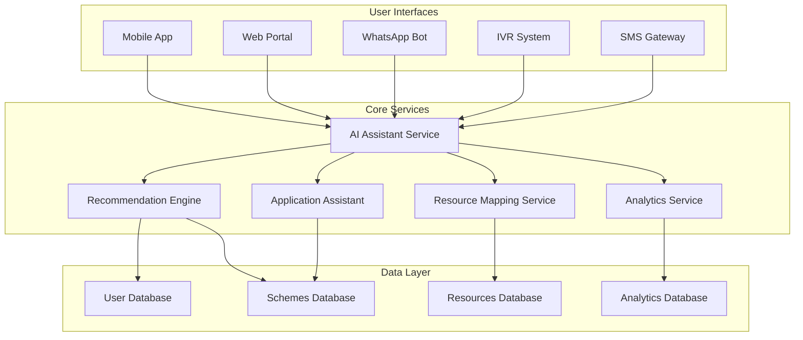

# LokSaarthi AI 🇮🇳

> *Bridging the digital divide between citizens and public services in India*

LokSaarthi AI is a comprehensive AI-powered community assistance platform that democratizes access to government schemes, welfare programs, healthcare services, and employment opportunities through a unified, multi-language, multi-modal interface.

## 🌟 Vision

To create an inclusive digital public service platform that ensures no citizen is left behind in accessing government benefits and public services, regardless of their language, location, or technological literacy.

## ✨ Key Features

### 🤖 AI Conversational Assistant
- **Multi-language Support**: 10+ regional languages including Hindi, Tamil, Telugu, Bengali, Marathi, Gujarati, Kannada, Malayalam, and Punjabi
- **Voice & Text Interaction**: Seamless speech-to-text and text-to-speech capabilities
- **Cross-platform Availability**: Mobile apps, web portal, WhatsApp, IVR, and SMS

### 🎯 Personalized Recommendations
- **Smart Eligibility Matching**: AI-powered analysis of user profiles against available schemes
- **Comprehensive Coverage**: Scholarships, jobs, healthcare programs, and welfare schemes
- **Deadline Tracking**: Automatic alerts for application deadlines and requirements

### 📋 Smart Application Assistance
- **Step-by-step Guidance**: Simplified application processes with automated form filling
- **Document Management**: Upload assistance with validation and checklists
- **Real-time Tracking**: SMS notifications and status updates throughout the application process

### 🗺️ Community Resource Mapping
- **Location-based Discovery**: Find nearby hospitals, government offices, skill centers, NGOs, and legal aid
- **Real-time Information**: Current operating hours, contact details, and available services
- **Navigation Integration**: Direct routing and accessibility information

### 📱 Multi-platform Accessibility
- **Native Mobile Apps**: Android and iOS applications with offline capabilities
- **Responsive Web Portal**: Browser-based access with full feature parity
- **WhatsApp Integration**: Complete service access through WhatsApp Business API
- **IVR System**: Phone-based access for users without internet connectivity

### 📊 Analytics Dashboard
- **Government Insights**: Real-time usage statistics and adoption metrics for officials
- **Data-driven Decisions**: Geographic distribution analysis and trending service requests
- **Privacy-compliant Reporting**: Anonymized data exports in CSV and PDF formats

## 🏗️ Architecture

### Technology Stack

**Backend Services:**
- **Runtime**: Node.js with TypeScript
- **AI/ML**: Python with FastAPI
- **Database**: PostgreSQL + Redis caching
- **Message Queue**: Apache Kafka
- **Search**: Elasticsearch

**AI/ML Technologies:**
- **LLM**: OpenAI GPT-4 / Anthropic Claude
- **Indic NLP**: AI4Bharat's IndicNLP library
- **Speech Processing**: Google Cloud Speech APIs with Indic language models
- **Translation**: Google Translate API with custom Indic models

**Frontend Technologies:**
- **Mobile**: React Native (cross-platform)
- **Web**: React.js with responsive design
- **WhatsApp**: WhatsApp Business API
- **IVR**: Twilio Voice API

**Infrastructure:**
- **Cloud**: AWS/Google Cloud Platform
- **Containers**: Docker + Kubernetes
- **CDN**: CloudFront
- **Monitoring**: Prometheus + Grafana + ELK stack

### Core Services



## 🚀 Getting Started

### Prerequisites

- Node.js 18+ and npm/yarn
- Python 3.9+ with pip
- PostgreSQL 14+
- Redis 6+
- Docker and Docker Compose

### Installation

1. **Clone the repository**
   ```bash
   git clone https://github.com/vivekpunde05/Loksaarthi_AI.git
   cd Loksaarthi_AI
   ```

2. **Set up the development environment**
   ```bash
   # Install backend dependencies
   npm install
   
   # Install Python AI service dependencies
   cd ai-services
   pip install -r requirements.txt
   cd ..
   
   # Set up database
   docker-compose up -d postgres redis
   npm run db:migrate
   ```

3. **Configure environment variables**
   ```bash
   cp .env.example .env
   # Edit .env with your API keys and configuration
   ```

4. **Start development services**
   ```bash
   # Start all services
   docker-compose up -d
   
   # Start backend API
   npm run dev:api
   
   # Start AI services
   npm run dev:ai
   
   # Start web frontend
   npm run dev:web
   ```

## 📋 Implementation Roadmap

The project follows a structured implementation plan with 20 main tasks:

### Phase 1: Foundation (Tasks 1-6)
- [x] Project infrastructure setup
- [ ] Core data models and database layer
- [ ] AI Assistant Service foundation
- [ ] Conversation and intent handling
- [ ] Recommendation Engine
- [ ] **Checkpoint**: Core AI services functional

### Phase 2: Core Services (Tasks 7-14)
- [ ] Application Assistant Service
- [ ] Resource Mapping Service
- [ ] Offline and connectivity management
- [ ] Analytics Service
- [ ] Security and privacy features
- [ ] Government system integration
- [ ] System resilience and auto-scaling
- [ ] **Checkpoint**: Backend services complete

### Phase 3: User Interfaces (Tasks 15-20)
- [ ] Mobile applications (React Native)
- [ ] Web portal (React.js)
- [ ] WhatsApp Business API integration
- [ ] IVR system integration
- [ ] Cross-platform integration
- [ ] **Final Checkpoint**: Complete system validation

## 🧪 Testing Strategy

### Dual Testing Approach
- **Unit Tests**: Specific examples, edge cases, and error conditions
- **Property-Based Tests**: Universal correctness properties across all inputs

### Correctness Properties
The system validates 15 key correctness properties including:
- Multi-language response consistency
- Cross-channel feature parity
- Comprehensive eligibility analysis
- Location-based resource discovery
- Data security and privacy protection

## 📚 Documentation

- **[Requirements Document](.kiro/specs/loksaarthi-ai/requirements.md)**: Detailed user stories and acceptance criteria
- **[Design Document](.kiro/specs/loksaarthi-ai/design.md)**: Architecture, components, and correctness properties
- **[Implementation Tasks](.kiro/specs/loksaarthi-ai/tasks.md)**: Step-by-step development plan

## 🤝 Contributing

We welcome contributions! Please see our [Contributing Guidelines](CONTRIBUTING.md) for details.

### Development Workflow
1. Fork the repository
2. Create a feature branch (`git checkout -b feature/amazing-feature`)
3. Commit your changes (`git commit -m 'Add amazing feature'`)
4. Push to the branch (`git push origin feature/amazing-feature`)
5. Open a Pull Request

## 📄 License

This project is licensed under the MIT License - see the [LICENSE](LICENSE) file for details.

## 🙏 Acknowledgments

- **AI4Bharat** for Indic NLP libraries and language models
- **Government of India** for open data initiatives and API access
- **Community Contributors** who help make public services more accessible

## 📞 Support

- **Issues**: [GitHub Issues](https://github.com/vivekpunde05/Loksaarthi_AI/issues)
- **Discussions**: [GitHub Discussions](https://github.com/vivekpunde05/Loksaarthi_AI/discussions)
- **Email**: support@loksaarthi.ai

---

**Made with ❤️ for the people of India**

*LokSaarthi AI - Empowering every citizen with equal access to public services*